# SafeVision

> **Sistema de Vigilância Inteligente Híbrido para Câmeras Corporais (Body-Worn Cameras) com Processamento na Borda.**

---

## 🎯 Executive Summary

O **SafeVision** é uma resposta de engenharia ao problema de latência em segurança pública. Em vez de transmitir streams pesados para a nuvem, movemos a inteligência para a borda (**Edge AI**).

O sistema processa vídeo localmente (YOLOv8/MediaPipe), detecta ameaças em milissegundos e transmite apenas metadados e evidências criptografadas, garantindo eficiência de banda e resposta em tempo real.

---

## 📐 Architecture Decision Records (ADR)

Seguindo as boas práticas de arquitetura de software, todas as decisões estruturantes do projeto estão documentadas. Isso garante histórico, contexto e justificativa técnica para cada escolha.

> **[📂 Acessar Diretório de Documentação](docs/adr/README.md)**

| ID | Decisão Arquitetural | Status | Contexto / Racional |
| :--- | :--- | :---: | :--- |
| [ADR-001](docs/adr/001-microservices-architecture.md) | **Microservices Architecture** | ✅ Aceito | Desacoplamento do *Core* (Java) e *Edge AI* (Python) para escala independente. |
| [ADR-002](docs/adr/002-edge-computing-strategy.md) | **Edge Computing First** | ✅ Aceito | Processamento na origem para eliminar latência de rede e reduzir custos de banda 4G/5G. |
| [ADR-003](docs/adr/003-async-communication-rabbitmq.md) | **Async Communication (RabbitMQ)** | ✅ Aceito | Garantia de entrega de alertas e resiliência em caso de falha de rede temporária. |
| [ADR-004](docs/adr/004-secret-management-vault.md) | **Secret Management (Vault)** | 📅 Planejado | (Fase 2) Centralização de segredos e rotação automática para segurança Zero Trust. |
| [ADR-005](docs/adr/005-orchestration-k8s-k3s.md) | **Orchestration (K8s & K3s)** | 📅 Planejado | (Fase 2) Gerenciamento unificado de containers na Cloud (K8s) e nos dispositivos Edge (K3s). |
| [ADR-006](docs/adr/006-distributed-caching-redis.md) | **Distributed Caching (Redis)** | 📅 Planejado | (Fase 2) Otimização de performance para dados de sessão e configurações quentes. |
| [ADR-007](docs/adr/007-observability-stack.md) | **Observability Stack (PLG)** | 📅 Planejado | (Fase 2) Adoção de Prometheus, Loki e Grafana para monitoramento integral. |
| [ADR-008](docs/adr/008-mobile-framework-flutter.md) | **Mobile Framework (Flutter)** | 🔮 Futuro | (Fase 3) Desenvolvimento do *Officer Companion App* com base de código única (Android/iOS). |

---

## 🗺️ Roadmap Estratégico & Sprint Planning

O projeto segue um ciclo de vida iterativo. Abaixo, o status detalhado das fases de desenvolvimento, alinhado com o [Board do Projeto](https://github.com/users/fdesenho/projects/1).

### ✅ Fase 1: Estabilização (MVP)
> **Status:** Parcialmente Concluído. Foco na redução de débito técnico e estabilidade do Core.

| Tarefa (Issue) | Prioridade | Deadline | Status |
| :--- | :---: | :---: | :---: |
| **Core Architecture (Microservices)** Discovery, Gateway, Auth | 🔥 Critical | 30/10/2025 | ✅ Done |
| **Edge AI (YOLOv8 Integration)** Detecção local de objetos | 🔥 Critical | 20/11/2025 | ✅ Done |
| **Comunicação Assíncrona (RabbitMQ)** Pipeline de eventos | 🔥 Critical | 05/12/2025 | ✅ Done |
| **Frontend Dashboard** Monitoramento em tempo real (Angular) | 🟡 Medium | 20/12/2025 | ✅ Done |
| **Cobertura de Testes (80%)** Unitários e Integração (JUnit 5) | 🔥 Critical | 20/01/2026 | 🚧 Doing |
| **Documentação API (Swagger)** OpenAPI 3.0 para consumo externo | 🟡 Medium | 30/01/2026 | 📅 Todo |

### 🏗️ Fase 2: Otimização de Infraestrutura
> **Status:** Planejado. Transformação do MVP em produto "Enterprise Ready".

| Tarefa (Issue) | Deadline | Racional Técnico (Linked ADR) |
| :--- | :---: | :--- |
| **Gestão de Segredos (Vault)** | 14/02/2026 | Implementação conforme [ADR-004](docs/adr/004-secret-management-vault.md). |
| **Pipeline CI/CD (GitHub Actions)** | 28/02/2026 | Automação do ciclo de build/deploy para suportar releases frequentes. |
| **Migração para Kubernetes** | 25/03/2026 | Orquestração Híbrida conforme [ADR-005](docs/adr/005-orchestration-k8s-k3s.md). |
| **Monitoramento Avançado (PLG)** | 10/04/2026 | Observabilidade total conforme [ADR-007](docs/adr/007-observability-stack.md). |
| **Caching Distribuído (Redis)** | 20/04/2026 | Otimização de leitura conforme [ADR-006](docs/adr/006-distributed-caching-redis.md). |

### 📱 Fase 3: Expansão de Recursos
> **Status:** Backlog. Foco na experiência do oficial em campo e hardware.

| Tarefa (Issue) | Previsão | Escopo |
| :--- | :---: | :--- |
| **App Mobile (Officer Companion)** | Jun/2026 | App Flutter conforme [ADR-008](docs/adr/008-mobile-framework-flutter.md). |
| **Visão Computacional Avançada** | Jun/2026 | Detecção Térmica e "Man-down" (queda do oficial). Paralelo ao Mobile. |
| **Integração 5G & Network Slicing** | Jul/2026 | Otimização de QoS de rede para cenários de alta densidade. |

### 📊 Fase 4: Intelligence & Analytics
> **Status:** Visão de Longo Prazo. Monetização de dados.

* 📅 **Ago/2026:** SafeVision Analytics (BI) - Dashboards gerenciais.
* 📅 **Set/2026:** Análise Forense de Vídeo - Busca semântica em storage (MinIO).
* 📅 **Out/2026:** Federação de Dados - Arquitetura multi-tenant.

---

## 🏗️ Diagrama de Arquitetura (C4 Container)

Abaixo, a visão lógica dos microsserviços e suas interações com o mundo externo e dispositivos de borda.

```mermaid
graph TD
    %% === ESTILOS C4 MODEL ===
    classDef person fill:#08427b,stroke:#052e56,stroke-width:2px,color:#ffffff;
    classDef container fill:#1168bd,stroke:#0b4884,stroke-width:2px,color:#ffffff;
    classDef component fill:#85bbf0,stroke:#5d82a8,stroke-width:2px,color:#000000;
    classDef database fill:#1168bd,stroke:#0b4884,stroke-width:2px,color:#ffffff;
    classDef external fill:#999999,stroke:#6b6b6b,stroke-width:2px,color:#ffffff;

    %% === ATORES ===
    User(("👤 Segurança<br/>[Pessoa]"))
    Dev(("👨‍💻 Desenvolvedor<br/>[Pessoa]"))
    class User,Dev person

    %% === SISTEMAS EXTERNOS (NOTIFICAÇÕES) ===
    subgraph Ext [☁️ Provedores Externos de Notificação]
        direction TB
        Telegram["✈️ API Telegram<br/>[Sistema]"]
        SMS["📱 Gateway SMS<br/>[Sistema]"]
        Email["📧 Serviço de Email<br/>[Sistema]"]
    end
    class Telegram,SMS,Email external

    %% === DEVOPS & INFRA (GITHUB/DOCKER) ===
    subgraph DevOps [🛠️ DevOps e CI/CD]
        direction TB
        GitHub["🐙 GitHub<br/>[Sistema: VCS/Actions]"]
        DockerReg["🐳 Docker Registry<br/>[Sistema: Artefatos]"]
    end
    class GitHub,DockerReg external

    %% === LIMITE DO SISTEMA SAFEVISION ===
    subgraph SafeVision [🛡️ Sistema SafeVision - Docker Host]
        direction TB

        %% --- CAMADA DE APRESENTAÇÃO ---
        subgraph LayerFront [💻 Camada de Apresentação]
            Frontend["🖥️ Aplicação Frontend<br/>[Container: Angular 21]<br/>Tech: RxStomp, Axios"]
        end
        class Frontend container

        %% --- CAMADA DE BORDA / EDGE ---
        subgraph LayerEdge [📍 Camada Edge / IoT]
            direction TB
            Camera["📹 Dispositivo de Câmera<br/>[Hardware]"]
            
            subgraph VisionAgent ["🐍 Agente de Visão<br/>[Container: Python 3.11]"]
                VA_Flask["🌐 Servidor Flask<br/>[Componente: API/MJPEG]"]
                VA_Core["🧠 Motor de Vigilância<br/>[Componente: OpenCV/YOLOv8]"]
                VA_Queue["🔄 Fila Assíncrona<br/>[Componente]"]
            end
        end
        class Camera component
        class VisionAgent container
        class VA_Flask,VA_Core,VA_Queue component

        %% --- CAMADA DE BACKEND ---
        subgraph LayerBack [⚙️ Camada de Lógica de Negócio]
            direction TB
            Eureka["🔍 Servidor Eureka<br/>[Container: Spring Boot]<br/>Tech: Descoberta de Serviço"]
            
            Gateway["⛩️ API Gateway<br/>[Container: Spring Boot 3]<br/>Tech: Spring Security, Spring Cloud Circuit Breaker,<br/>Resilience4j"]

            Auth["🔐 Serviço de Autenticação<br/>[Container: Spring Boot 3]<br/>Tech: Spring Security, Spring Web,<br/>Spring Data JPA"]
            
            Recog["🧠 Serviço de Reconhecimento<br/>[Container: Java 21]<br/>Tech: Drools, Spring AMQP,<br/>Slf4j, Spring Cloud Sleuth"]
            
            Alert["🚨 Serviço de Alerta<br/>[Container: Spring Boot 3]<br/>Tech: Spring Web, Java Mail, Spring AMQP,<br/>Spring Data JPA, Slf4j, Spring Cloud Sleuth"]
        end
        class Gateway,Recog,Alert,Auth,Eureka container

        %% --- CAMADA DE DADOS E INFRA ---
        subgraph LayerData [💾 Camada de Dados e Infra]
            MinIO[("🗄️ MinIO<br/>[Container: Object Storage]")]
            RabbitMQ("🐇 RabbitMQ<br/>[Container: Broker de Mensagens]")
            Postgres[("🐘 PostgreSQL<br/>[Container: Banco de Dados]")]
            ZipKin("📉 ZipKin<br/>[Container: Rastreamento]")
        end
        class MinIO,RabbitMQ,Postgres,ZipKin database
    end

    %% === REALCE DAS LINHAS DAS CAMADAS (Bordas Grossas) ===
    style SafeVision fill:none,stroke:#333,stroke-width:2px,stroke-dasharray: 5 5
    style LayerFront fill:#e8f4fa,stroke:#0d6efd,stroke-width:4px
    style LayerEdge fill:#fff0f5,stroke:#d63384,stroke-width:4px
    style LayerBack fill:#e9f7ef,stroke:#198754,stroke-width:4px
    style LayerData fill:#fff9e6,stroke:#ffc107,stroke-width:4px
    style Ext fill:#f0f0f0,stroke:#999,stroke-width:2px
    style DevOps fill:#e6e6fa,stroke:#663399,stroke-width:2px

    %% === FLUXO DEVOPS (Deploy) ===
    Dev ==>|"Commit/Push Código"| GitHub
    GitHub -->|"Dispara Build e Teste"| GitHub
    GitHub -->|"Push Imagem Docker"| DockerReg
    DockerReg -.->|"Pull Imagens (Deploy)"| LayerBack
    DockerReg -.->|"Pull Imagens (Deploy)"| LayerFront
    DockerReg -.->|"Pull Imagens (Deploy)"| VisionAgent

    %% === SERVICE DISCOVERY (REGISTRO) ===
    Gateway & Auth & Recog & Alert -.->|"Registro/Heartbeat"| Eureka

    %% === FLUXO 1: ATIVAÇÃO & AUTENTICAÇÃO ===
    User ==>|"1. Login / Ativar"| Frontend
    Frontend -->|"2. Requisição HTTPS"| Gateway
    Gateway -->|"2a. Autenticação/Validar JWT"| Auth
    Auth -->|"2b. Dados Usuário"| Postgres
    
    Gateway -->|"3. POST /start (Proxy)"| VA_Flask
    VA_Flask -->|"3a. Inicia Thread"| VA_Core
    VA_Core -->|"4. Ligar"| Camera

    %% === FLUXO 2: VÍDEO STREAM ===
    Camera -->|"Frames Brutos"| VA_Core
    VA_Core -->|"Buffer MJPEG"| VA_Flask
    VA_Flask -.->|"Stream HTTP (Visualização)"| Frontend

    %% === FLUXO 3: DETECÇÃO E EVIDÊNCIA ===
    VA_Core -- "Detectar" --> VA_Core
    VA_Core -->|"5. Upload Imagem"| MinIO
    MinIO -- "URL Assinada" --> VA_Core

    %% === FLUXO 4: MENSAGERIA E REGRAS ===
    VA_Core -->|"6. Enfileirar Dados"| VA_Queue
    VA_Queue -->|"7. Publica: vision_events"| RabbitMQ
    
    RabbitMQ -->|"8. Consome Evento"| Recog
    Recog -->|"9. Aplica Regras (Drools)"| Recog
    Recog -->|"10. Publica: Alertas"| RabbitMQ
    Recog -.->|"Logs de Rastreamento"| ZipKin

    %% === FLUXO 5: ALERTA E NOTIFICAÇÃO ===
    RabbitMQ -->|"11. Consome Alerta"| Alert
    Alert -->|"12. Persiste"| Postgres
    Alert -.->|"Logs de Rastreamento"| ZipKin
    
    Alert -->|"13. Envia API"| Telegram
    Alert -->|"13. Envia Gateway"| SMS
    Alert -->|"13. Envia SMTP"| Email
    
    Telegram & SMS & Email -.->|"🚨 NOTIFICAÇÃO"| User
    
    Alert -->|"14. Pub WebSocket"| Gateway
    Gateway -->|"15. Push Pop-up"| Frontend

    %% === AJUSTE DE LINKS (Layout) ===
    linkStyle 7,8,9 stroke:#663399,stroke-width:1px,stroke-dasharray: 4 2;
```

---

## Camadas da Arquitetura

### 1. Presentation Layer (Apresentação)
*   **Frontend Application**: Single Page Application (SPA) desenvolvida em **Angular 21**. Responsável pela interação com o usuário, exibição do stream de vídeo e alertas em tempo real.

### 2. Edge / IoT Layer (Borda)
*   **Vision Agent**: Container **Python 3.11** rodando próximo à câmera. Responsável pelo processamento pesado de visão computacional (**OpenCV**, **YOLOv8**).
*   **Camera Device**: Hardware físico de captura.

### 3. Business Logic Layer (Backend - Spring Cloud)
A camada de backend foi enriquecida com componentes da stack Spring Cloud para resiliência e observabilidade.

*   **Eureka Server**: Servidor de descoberta de serviços (Service Discovery). Permite que os microserviços se encontrem dinamicamente.
*   **API Gateway**: Ponto de entrada seguro (**Spring Boot 3**, **Spring Security**). Implementa **Resilience4j Circuit Breaker** para falhar graciosamente em caso de sobrecarga.
*   **Auth Service**: Serviço dedicado para autenticação e autorização (**OAuth2**, **JWT**), utilizando **Spring Data JPA** para persistência de usuários.
*   **Recognition Service**: Serviço de regras de negócio (**Drools**). Utiliza **Spring AMQP** para mensageria, **Slf4j** para logs estruturados e **Spring Cloud Sleuth** para rastreamento distribuído.
*   **Alert Service**: Gerenciador de notificações. Utiliza **Spring Data JPA** para persistência de alertas, **Java Mail** para envios e **Sleuth/Slf4j** para monitoramento.

### 4. Data & Infra Layer (Dados)
*   **MinIO**: Armazenamento de objetos para evidências (imagens/vídeos das detecções).
*   **RabbitMQ**: Message Broker para desacoplamento assíncrono.
*   **PostgreSQL**: Persistência de logs de auditoria, usuários (Auth) e alertas.
*   **ZipKin**: Coleta e visualização de traços distribuídos gerados pelo Sleuth.

### 5. DevOps & Infrastructure (Novo)
*   **GitHub**: Repositório de código fonte e plataforma de CI/CD (GitHub Actions) que dispara os builds.
*   **Docker Registry**: Armazena as imagens de container geradas.
*   **Docker Host**: Ambiente de execução onde todos os containers da aplicação SafeVision são implantados.