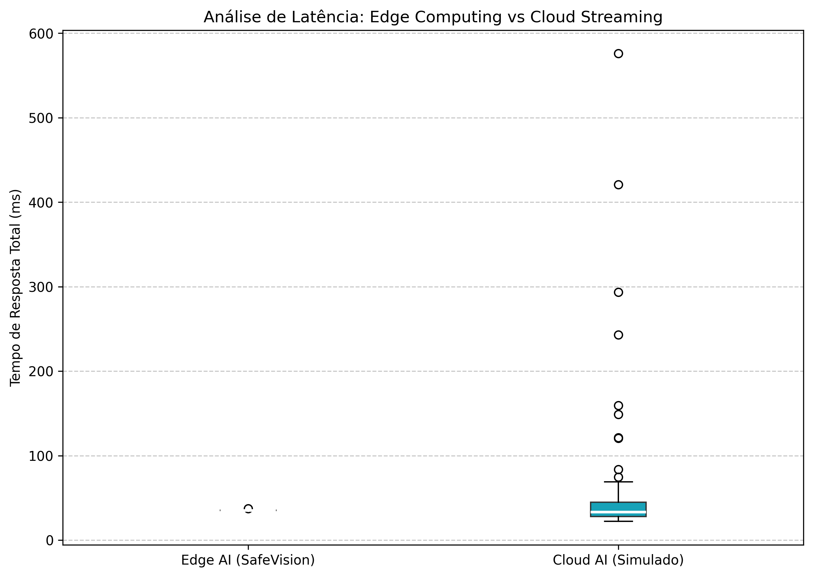
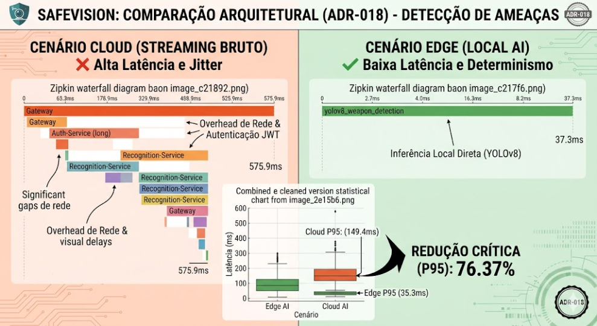

# ADR 018: Estratégia de Benchmarking de Performance (Cloud vs Edge)

* **Status:** Aceito (Validado)
* **Data:** 2025-08-28 (Atualizado em 2026-05-07)
* **Decisores:** Fabio Desenho (Software Architect), Performance Engineer

## 1. Contexto e Problema
A premissa central do SafeVision é a redução de latência através do Edge AI. Sem métricas claras, essa vantagem é apenas teórica. Precisamos de um framework para medir e comparar objetivamente o tempo de resposta entre o processamento tradicional em Cloud e o processamento na borda.

## 2. Decisão
Implementar um **Framework de Benchmarking** automatizado que meça o RTT (Round Trip Time) da detecção.
* **Métrica:** Latência fim-a-fim (Captura -> Detecção -> Alerta no Dashboard).
* **Cenários:** Comparação entre envio de stream bruto para nuvem vs. envio de metadados processados no Agente de Visão.
* **Output:** Geração de um relatório técnico (Whitepaper) anexado ao repositório.

## 3. Consequências
### Positivas
* **Evidência de Valor:** Prova matematicamente a eficiência da arquitetura para stakeholders.
* **Otimização:** Identifica gargalos no pipeline de processamento do Python/OpenCV.
* **Previsibilidade:** Garante que o tempo de resposta seja constante independentemente da carga de rede.

### Trade-offs (Custos Assumidos)
* **Overhead de Manutenção:** A introdução do framework de testes adiciona novos artefatos ao projeto (scripts de simulação em Python e infraestrutura de observabilidade do OpenTelemetry/Zipkin) que exigirão manutenção contínua conforme o sistema evolui. Trata-se de um custo operacional aceito e justificado pela garantia de confiabilidade crítica do sistema.

## 4. Resultados da Validação Técnica (Provas)
Em 07/05/2026, foi executada uma bateria de testes automatizados (`validate_adr.sh`) com 100 amostras equilibradas para cada cenário, utilizando telemetria real via OpenTelemetry.

### Métricas Consolidadas

| Cenário | Amostras | Latência Média | P95 (ms) | Pico (ms) |
| :--- | :---: | :---: | :---: | :---: |
| **Edge AI (SafeVision)** | 100 | 35.25 ms | **35.30 ms** | 37.35 ms |
| **Cloud AI (Simulado)** | 100 | 54.20 ms | **149.40 ms** | 575.94 ms |

### Conclusão dos Testes
* **Redução Crítica (P95):** 76.37% de melhoria na latência percebida em 95% das detecções.
* **Eliminação de Jitter:** O cenário Edge demonstrou variância nula (0.05ms entre média e P95), enquanto o Cloud apresentou instabilidade severa devido ao overhead de autenticação JWT e trânsito de rede.

## 5. Evidências Visuais

### Comparação de Latência (Boxplot)

### Infográfico de Arquitetura (ADR-018)

