# SafeVision - Arquitetura de Software (C4 Model)

Este documento descreve a arquitetura do sistema SafeVision utilizando a abordagem C4 Model (Nível de Container e Componente).

## Diagrama de Container (Mermaid)

O diagrama abaixo ilustra os Containers (aplicações, serviços, bancos de dados) e suas interações, organizados em camadas arquiteturais.

```mermaid
graph TD
    %% === ESTILOS C4 MODEL ===
    classDef person fill:#08427b,stroke:#052e56,stroke-width:2px,color:#ffffff;
    classDef container fill:#1168bd,stroke:#0b4884,stroke-width:2px,color:#ffffff;
    classDef component fill:#85bbf0,stroke:#5d82a8,stroke-width:2px,color:#000000;
    classDef database fill:#1168bd,stroke:#0b4884,stroke-width:2px,color:#ffffff;
    classDef external fill:#999999,stroke:#6b6b6b,stroke-width:2px,color:#ffffff;

    %% === ATORES ===
    User(("👤 Segurança<br/>[Pessoa]"))
    Dev(("👨‍💻 Desenvolvedor<br/>[Pessoa]"))
    class User,Dev person

    %% === SISTEMAS EXTERNOS (NOTIFICAÇÕES) ===
    subgraph Ext [☁️ Provedores Externos de Notificação]
        direction TB
        Telegram["✈️ API Telegram<br/>[Sistema]"]
        SMS["📱 Gateway SMS<br/>[Sistema]"]
        Email["📧 Serviço de Email<br/>[Sistema]"]
    end
    class Telegram,SMS,Email external

    %% === DEVOPS & INFRA (GITHUB/DOCKER) ===
    subgraph DevOps [🛠️ DevOps e CI/CD]
        direction TB
        GitHub["🐙 GitHub<br/>[Sistema: VCS/Actions]"]
        DockerReg["🐳 Docker Registry<br/>[Sistema: Artefatos]"]
    end
    class GitHub,DockerReg external

    %% === LIMITE DO SISTEMA SAFEVISION ===
    subgraph SafeVision [🛡️ Sistema SafeVision - Docker Host]
        direction TB

        %% --- CAMADA DE APRESENTAÇÃO ---
        subgraph LayerFront [💻 Camada de Apresentação]
            Frontend["🖥️ Aplicação Frontend<br/>[Container: Angular 21]<br/>Tech: RxStomp, Axios"]
        end
        class Frontend container

        %% --- CAMADA DE BORDA / EDGE ---
        subgraph LayerEdge [📍 Camada Edge / IoT]
            direction TB
            Camera["📹 Dispositivo de Câmera<br/>[Hardware]"]
            
            subgraph VisionAgent ["🐍 Agente de Visão<br/>[Container: Python 3.11]"]
                VA_Flask["🌐 Servidor Flask<br/>[Componente: API/MJPEG]"]
                VA_Core["🧠 Motor de Vigilância<br/>[Componente: OpenCV/YOLOv8]"]
                VA_Queue["🔄 Fila Assíncrona<br/>[Componente]"]
            end
        end
        class Camera component
        class VisionAgent container
        class VA_Flask,VA_Core,VA_Queue component

        %% --- CAMADA DE BACKEND ---
        subgraph LayerBack [⚙️ Camada de Lógica de Negócio]
            direction TB
            Eureka["🔍 Servidor Eureka<br/>[Container: Spring Boot]<br/>Tech: Descoberta de Serviço"]
            
            Gateway["⛩️ API Gateway<br/>[Container: Spring Boot 3]<br/>Tech: Spring Security, Spring Cloud Circuit Breaker,<br/>Resilience4j"]

            Auth["🔐 Serviço de Autenticação<br/>[Container: Spring Boot 3]<br/>Tech: Spring Security, Spring Web,<br/>Spring Data JPA"]
            
            Recog["🧠 Serviço de Reconhecimento<br/>[Container: Java 21]<br/>Tech: Drools, Spring AMQP,<br/>Slf4j, Spring Cloud Sleuth"]
            
            Alert["🚨 Serviço de Alerta<br/>[Container: Spring Boot 3]<br/>Tech: Spring Web, Java Mail, Spring AMQP,<br/>Spring Data JPA, Slf4j, Spring Cloud Sleuth"]
        end
        class Gateway,Recog,Alert,Auth,Eureka container

        %% --- CAMADA DE DADOS E INFRA ---
        subgraph LayerData [💾 Camada de Dados e Infra]
            MinIO[("🗄️ MinIO<br/>[Container: Object Storage]")]
            RabbitMQ("🐇 RabbitMQ<br/>[Container: Broker de Mensagens]")
            Postgres[("🐘 PostgreSQL<br/>[Container: Banco de Dados]")]
            ZipKin("📉 ZipKin<br/>[Container: Rastreamento]")
        end
        class MinIO,RabbitMQ,Postgres,ZipKin database
    end

    %% === REALCE DAS LINHAS DAS CAMADAS (Bordas Grossas) ===
    style SafeVision fill:none,stroke:#333,stroke-width:2px,stroke-dasharray: 5 5
    style LayerFront fill:#e8f4fa,stroke:#0d6efd,stroke-width:4px
    style LayerEdge fill:#fff0f5,stroke:#d63384,stroke-width:4px
    style LayerBack fill:#e9f7ef,stroke:#198754,stroke-width:4px
    style LayerData fill:#fff9e6,stroke:#ffc107,stroke-width:4px
    style Ext fill:#f0f0f0,stroke:#999,stroke-width:2px
    style DevOps fill:#e6e6fa,stroke:#663399,stroke-width:2px

    %% === FLUXO DEVOPS (Deploy) ===
    Dev ==>|"Commit/Push Código"| GitHub
    GitHub -->|"Dispara Build e Teste"| GitHub
    GitHub -->|"Push Imagem Docker"| DockerReg
    DockerReg -.->|"Pull Imagens (Deploy)"| LayerBack
    DockerReg -.->|"Pull Imagens (Deploy)"| LayerFront
    DockerReg -.->|"Pull Imagens (Deploy)"| VisionAgent

    %% === SERVICE DISCOVERY (REGISTRO) ===
    Gateway & Auth & Recog & Alert -.->|"Registro/Heartbeat"| Eureka

    %% === FLUXO 1: ATIVAÇÃO & AUTENTICAÇÃO ===
    User ==>|"1. Login / Ativar"| Frontend
    Frontend -->|"2. Requisição HTTPS"| Gateway
    Gateway -->|"2a. Autenticação/Validar JWT"| Auth
    Auth -->|"2b. Dados Usuário"| Postgres
    
    Gateway -->|"3. POST /start (Proxy)"| VA_Flask
    VA_Flask -->|"3a. Inicia Thread"| VA_Core
    VA_Core -->|"4. Ligar"| Camera

    %% === FLUXO 2: VÍDEO STREAM ===
    Camera -->|"Frames Brutos"| VA_Core
    VA_Core -->|"Buffer MJPEG"| VA_Flask
    VA_Flask -.->|"Stream HTTP (Visualização)"| Frontend

    %% === FLUXO 3: DETECÇÃO E EVIDÊNCIA ===
    VA_Core -- "Detectar" --> VA_Core
    VA_Core -->|"5. Upload Imagem"| MinIO
    MinIO -- "URL Assinada" --> VA_Core

    %% === FLUXO 4: MENSAGERIA E REGRAS ===
    VA_Core -->|"6. Enfileirar Dados"| VA_Queue
    VA_Queue -->|"7. Publica: vision_events"| RabbitMQ
    
    RabbitMQ -->|"8. Consome Evento"| Recog
    Recog -->|"9. Aplica Regras (Drools)"| Recog
    Recog -->|"10. Publica: Alertas"| RabbitMQ
    Recog -.->|"Logs de Rastreamento"| ZipKin

    %% === FLUXO 5: ALERTA E NOTIFICAÇÃO ===
    RabbitMQ -->|"11. Consome Alerta"| Alert
    Alert -->|"12. Persiste"| Postgres
    Alert -.->|"Logs de Rastreamento"| ZipKin
    
    Alert -->|"13. Envia API"| Telegram
    Alert -->|"13. Envia Gateway"| SMS
    Alert -->|"13. Envia SMTP"| Email
    
    Telegram & SMS & Email -.->|"🚨 NOTIFICAÇÃO"| User
    
    Alert -->|"14. Pub WebSocket"| Gateway
    Gateway -->|"15. Push Pop-up"| Frontend

    %% === AJUSTE DE LINKS (Layout) ===
    linkStyle 7,8,9 stroke:#663399,stroke-width:1px,stroke-dasharray: 4 2;
```

---

## Camadas da Arquitetura

### 1. Presentation Layer (Apresentação)
*   **Frontend Application**: Single Page Application (SPA) desenvolvida em **Angular 21**. Responsável pela interação com o usuário, exibição do stream de vídeo e alertas em tempo real.

### 2. Edge / IoT Layer (Borda)
*   **Vision Agent**: Container **Python 3.11** rodando próximo à câmera. Responsável pelo processamento pesado de visão computacional (**OpenCV**, **YOLOv8**).
*   **Camera Device**: Hardware físico de captura.

### 3. Business Logic Layer (Backend - Spring Cloud)
A camada de backend foi enriquecida com componentes da stack Spring Cloud para resiliência e observabilidade.

*   **Eureka Server**: Servidor de descoberta de serviços (Service Discovery). Permite que os microserviços se encontrem dinamicamente.
*   **API Gateway**: Ponto de entrada seguro (**Spring Boot 3**, **Spring Security**). Implementa **Resilience4j Circuit Breaker** para falhar graciosamente em caso de sobrecarga.
*   **Auth Service**: Serviço dedicado para autenticação e autorização (**OAuth2**, **JWT**), utilizando **Spring Data JPA** para persistência de usuários.
*   **Recognition Service**: Serviço de regras de negócio (**Drools**). Utiliza **Spring AMQP** para mensageria, **Slf4j** para logs estruturados e **Spring Cloud Sleuth** para rastreamento distribuído.
*   **Alert Service**: Gerenciador de notificações. Utiliza **Spring Data JPA** para persistência de alertas, **Java Mail** para envios e **Sleuth/Slf4j** para monitoramento.

### 4. Data & Infra Layer (Dados)
*   **MinIO**: Armazenamento de objetos para evidências (imagens/vídeos das detecções).
*   **RabbitMQ**: Message Broker para desacoplamento assíncrono.
*   **PostgreSQL**: Persistência de logs de auditoria, usuários (Auth) e alertas.
*   **ZipKin**: Coleta e visualização de traços distribuídos gerados pelo Sleuth.

### 5. DevOps & Infrastructure (Novo)
*   **GitHub**: Repositório de código fonte e plataforma de CI/CD (GitHub Actions) que dispara os builds.
*   **Docker Registry**: Armazena as imagens de container geradas.
*   **Docker Host**: Ambiente de execução onde todos os containers da aplicação SafeVision são implantados.